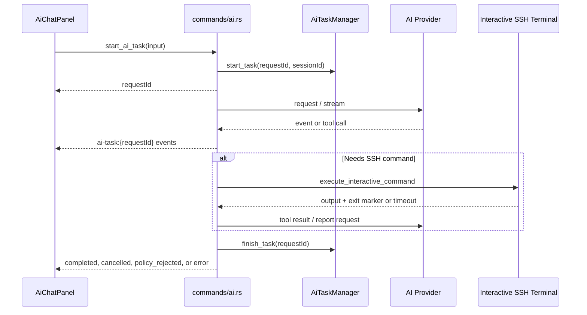
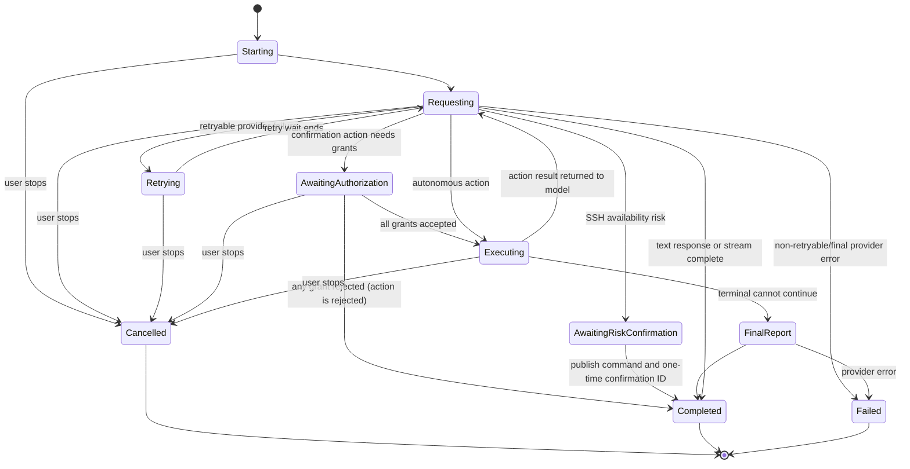
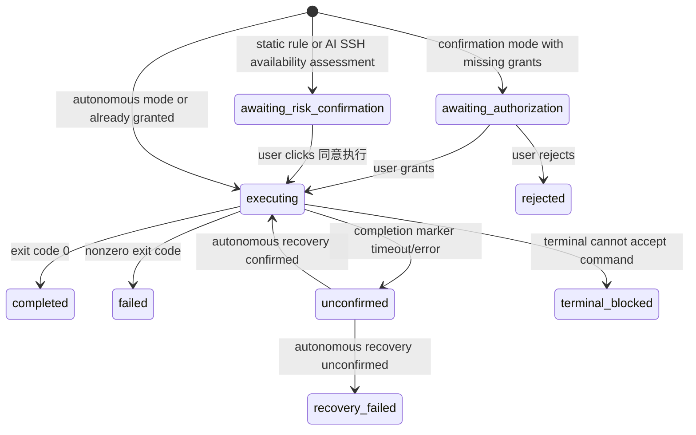

# AI 功能设计与维护指南

本文档描述当前 AI 辅助 SSH 功能的实际设计、事件协议与维护约束。代码和本文件应同步更新；修改 AI 的任务、执行、安全、日志或界面行为时，先检查本文件中的不变量。

## 1. 目标与边界

AI 功能通过 OpenAI 兼容的 Chat Completions 接口为当前 SSH 会话提供三种能力：

- 问答模式：只生成文本，不会运行 SSH 命令。
- 确认模式：AI 最多提出一个命令，用户完成程序授权后才执行。
- 自动模式：AI 可在同一个任务内反复提出并执行命令，根据每一步结果继续分析。

AI 不是独立的 SSH 通道。所有命令均发送至用户当前可见的交互式 SSH 终端，命令输出仍由终端负责显示。

不变量：

1. 一个 SSH session 同时最多有一个 AI 任务。
2. 所有任务必须绑定活跃 SSH session；session 已断开时不得启动。
3. 取消必须在 AI 请求、自动重试等待、授权等待和 SSH 执行等待中生效。
4. 已开始执行过 SSH 操作的手动重试不得再次执行该操作。
5. 操作历史不写入审计数据库；前端运行时状态展示历史，独立 `ai.log` 提供故障排查记录。

## 2. 模块与职责

| 区域 | 文件 | 职责 |
| --- | --- | --- |
| 前端任务界面 | `my-ssh-frontend/src/components/AiChatPanel.vue` | 发送消息、订阅任务事件、渲染消息/操作卡片、授权、取消与手动重试 |
| 前端状态 | `my-ssh-frontend/src/stores/ai.ts` | 按 SSH session 保存运行时对话和操作历史；加载 AI 配置与 Agent |
| 前端协议 | `my-ssh-frontend/src/types/ai.ts` | Tauri 调用参数和任务事件 TypeScript 类型 |
| Tauri 入口 | `my-ssh-frontend/src-tauri/src/commands/ai.rs` | 启动任务、分发三种模式、授权决策、SSH 执行与事件推送 |
| AI 客户端 | `my-ssh-frontend/src-tauri/src/ai/client.rs` | OpenAI 兼容请求、流式响应、工具调用解析、供应商重试、系统规则 |
| 任务与策略 | `my-ssh-frontend/src-tauri/src/ai/service.rs` | 会话级任务锁、取消 token、授权等待、统一 `ExecutionGuard` 与 Bash 静态可审计校验 |
| 风险确认 | `my-ssh-frontend/src-tauri/src/ai/risk_confirmation.rs` | 内存中的一次性 SSH 连通性风险确认，精确绑定命令与 SSH session |
| 类型 | `my-ssh-frontend/src-tauri/src/ai/models.rs` | Rust 的 Tauri 入参、事件和授权模型 |
| AI 审计 | `my-ssh-frontend/src-tauri/src/ai/audit.rs` | 任务、重试、动作与取消的脱敏审计摘要；不参与执行或授权决策 |
| AI 日志 | `my-ssh-frontend/src-tauri/src/ai/log.rs` | 独立滚动 `ai.log` 写入器 |
| 凭证库 | `my-ssh-frontend/src-tauri/src/vault/store.rs` | 在本地 JSON Vault 中持久化供应商配置、Agent 配置和可执行程序授权 |
| SSH 执行 | `my-ssh-frontend/src-tauri/src/ssh/client.rs` | 向既有交互终端写入命令、等待完成标记、超时后尝试恢复 |
| SSH 会话与终端 UI | `my-ssh-frontend/src-tauri/src/commands/ssh.rs`、`my-ssh-frontend/src/components/Terminal.vue` | 记录不含输入正文的写入失败、关闭无法恢复的终端并将断开和输入失效状态显示给用户 |

## 3. 配置与持久化

本地 `vault.json` 只保存需要持久化的配置：

- `aiProviderConfig`：base URL、模型、超时和 API Key；可为 `null`。
- `aiAgents`：Agent 名称、提示词、默认 Agent 标记。
- `aiExecutableGrants`：确认模式中用户授予的可执行程序权限。

未启用云同步时，`vault.json` 为明文；启用后，以上配置和所有 Vault 数据会作为整体加密副本上传。AI API Key、Agent 提示词、完整终端输出和完整模型响应不得出现在日志或错误消息中。完整存储与加密边界见 [db.md](db.md) 和 [cloud-sync.md](cloud-sync.md)。

不保存的内容：AI 操作审计记录、完整终端输出、完整 AI 响应。操作展示历史仅位于 Pinia 内存状态，关闭/刷新应用后不保证保留。

SSH 连通性风险确认也不写入持久化 Vault：`RiskConfirmationStore` 仅存于应用内存，原 AI 任务结束后仍可供用户下一条聊天消息确认，但应用退出或令牌超过 5 分钟后即失效。

授权范围：

| grant | 含义 | 是否持久化 |
| --- | --- | --- |
| `once` | 仅当前待执行操作 | 否 |
| `server` | 当前 server key | 是 |
| `global` | 所有服务器 | 是 |
| `reject` | 拒绝当前操作 | 否 |

系统白名单仅涵盖低风险过滤工具：`cat`、`grep`、`cut`、`sort`、`uniq`、`head`、`tail`、`tr`、`wc`、`printf`。不在白名单中的可执行文件需要按授权逻辑检查。

## 4. 模式与系统规则

系统规则由 `system_rules_for()` 按模式生成，并与 Agent 提示词、用户消息一起传给供应商。系统规则优先级最高，重点约束：

- 自动模式表示服务器所有者将当前 SSH 会话的管理权限交给 AI；不维护“普通管理员操作”白名单，也不会因路径、资源成本、密钥文件或系统工具本身阻止命令。
- 提示词要求模型先使用低成本诊断、分步检查和最小影响操作，但这些是执行策略建议，不是后端权限限制。
- 后端只识别两类连通性风险：可能立即中断当前 SSH 会话的操作，以及可能令服务器重启后无法通过 SSH 恢复连接的操作。
- 风险操作不会被永久禁止：AI 必须先输出风险、原始命令和一次性确认 ID。用户在下一条消息中明确同意后，AI 可使用该 ID 重新请求同一命令。

提示词用于让 AI 判断用户的自然语言是否构成同意；后端将确认 ID 绑定到当前 SSH session、规范化后的原始命令和 5 分钟有效期。只有三者精确匹配时才会一次性消费并放行；错误命令或错误 session 不会消耗令牌，过期令牌会被删除。提示词不能绕过该校验，也不能仅凭 ID 证明用户同意。

## 5. 命令策略与执行安全

`ai/service.rs` 使用 tree-sitter-bash 解析命令，不依赖文本正则猜测命令名。

### 5.1 通用校验

- 命令去除 Markdown 代码围栏后必须为合法 Bash。
- 命令长度为 1 至 16 KiB。
- 可执行文件必须是静态可见的裸名称，不能是包含 `/` 的路径或变量展开结果。
- 拒绝可构造动态命令的工具：`eval`、`source`、`.`、`sh`、`bash`、`dash`、`zsh`、`fish`、`env`、`busybox`、`xargs`。
- `sudo`、`doas` 会额外解析其目标可执行文件以进行确认模式授权。
- 自动模式不会因 `find /`、`find -exec`、敏感文件读取或资源成本拒绝命令；服务器所有者选择自动模式即授予当前 SSH 会话的管理权限。
- 自动模式和确认模式都会解析静态可见的可执行程序；动态构造/间接执行工具（如 `eval`、`source`、`sh -c`、`xargs`）会被拒绝，因为后端无法可靠审查实际执行内容。

### 5.2 统一执行入口

`ExecutionGuard::evaluate()` 是确认模式和自动模式共同的命令预检入口。它统一完成：Markdown 代码围栏规范化、Bash 静态可审计解析、静态可执行程序收集，以及自动模式的 SSH 连通性风险令牌决策。

它不负责持久化授权或写日志：确认模式的程序授权仍由 Vault 的 `ai_executable_grants` 和 `AiTaskManager` 授权等待处理；自动模式的风险令牌由独立的 `RiskConfirmationStore` 创建和一次性消费；`ai.log` 由独立 `ai/audit.rs` 生成脱敏摘要后写入。`commands/ai.rs` 只消费统一的 `ExecutionDecision`，再决定显示授权卡片、风险确认卡片或发送 SSH 命令。

`ExecutionDecision`：

- `Ready`：命令已经规范化并通过静态可审计校验；确认模式额外使用其中的程序列表计算授权，自动模式可继续执行。
- `RequireRiskConfirmation`：自动模式命中 SSH 可用性风险，附带精确绑定命令与 session 的一次性确认令牌；不得发送 SSH 命令。
- `Err(AiTaskError)`：命令不合法或不可静态审计；调用方不执行命令。

### 5.3 SSH 连通性风险确认

后端不维护普通操作白名单，也不尝试推断任意复杂命令的效果。它是刻意有限的防呆层。SSH 建立后会执行一次只读探测并缓存当前 session 的连接事实：实际 SSH 端口、客户端与服务端地址、回程路由接口、已挂载块设备及其父设备。静态提示仅使用这些事实：

- 重启或关机。
- SSH 服务的重启、停止、禁用或屏蔽。
- 明确封禁当前 SSH 端口或当前客户端来源的防火墙规则，而不是任意防火墙维护。
- 明确影响当前回程网络接口或服务端地址的网络操作，而不是任意接口或路由变更。
- `mkfs`、`wipefs` 等作用于当前已挂载文件系统设备或其父设备的操作；未挂载的数据盘不弹窗。
- 明确写入 SSH 配置或 `authorized_keys` 的命令。

仅查看 SSH 配置、读取 `authorized_keys`、检查防火墙或网络状态不会触发确认。模型也可在工具调用中设置 `requires_risk_confirmation: true` 和 `risk_reason`，将它判断为可能影响当前或后续 SSH 连通性的命令送入同一确认流程；不能仅因命令一般性地具有特权、破坏性或成本高而使用该字段。

触发后，本任务结束，前端显示风险操作卡片及“同意执行”按钮。按钮调用 `confirm_ai_risk_action`，后端只从一次性确认存储中读取已规范化的原始命令，绝不接受前端提交的命令字符串。令牌绑定 SSH session，5 分钟有效且仅能消费一次；令牌失效、会话不匹配或重放均不会执行命令。

安全探测失败不会阻塞 SSH 连接，也不会退化为拦截所有防火墙、网络或格式化命令；此时仍可由模型通过 `requires_risk_confirmation` 请求确认。复杂或不确定风险由自动模式系统提示词约束；模型不遵守提示词时，程序无法可靠识别任意 shell 行为。新增静态触发器或探测字段时，应同时修改：`SshSafetyContext`、`ssh_connectivity_risk()`、相关测试、系统规则和本文件。

## 6. 任务生命周期



### 6.1 启动

前端生成 UUID `requestId` 并调用 `start_ai_task`。后端：

1. 校验 `conversationId`、消息大小、模式和 scope。
2. 校验 SSH session 仍然存在。
3. 从 vault 读取供应商配置和选定 Agent。
4. 对该 session 创建带 `CancellationToken` 的任务；若已有活动任务则拒绝。
5. 以 `ai-task:{requestId}` 为事件名异步运行任务。

`StartAiTaskInput` 见 `src/types/ai.ts` 和 `ai/models.rs`。消息和可选终端上下文均有 8 KiB 上限；当前界面默认不附带终端上下文。

### 6.2 问答模式

调用 `stream_chat()`，将流式文本拆为 `delta` 事件。流连接建立前发生网络错误或可重试 HTTP 状态会重试；一旦已有输出后流中断，不自动重放，避免重复文本。

### 6.3 确认模式

1. AI 生成文本，或通过 `execute_ssh_command` 工具给出计划与一个命令。
2. 后端解析命令、执行硬安全校验，并计算所有可执行文件。
3. 已授权或系统白名单程序可直接继续；其余程序通过 `action_pending` 事件交给 UI。
4. UI 调用 `decide_ai_action` 提交每个程序的授权范围。
5. 拒绝任意程序时，命令不执行并生成 `rejected` 操作结果；这属于用户决策，任务本身仍以 `completed` 结束，不是 `error` 或 `policy_rejected`。
6. 执行完成后，AI 基于命令、退出码和有界输出生成报告。

### 6.4 自动模式

自动模式循环调用工具请求，按模型返回顺序逐项执行。每次请求前将既有工具调用和工具结果带回供应商。限制：

- 单任务最多 64 个动作，防止模型循环。
- 每条命令先通过 Bash 静态可审计校验，并仅对 SSH 可用性风险等待聊天确认。
- 命令依赖前一步输出时，模型应分多轮工具调用；应用在当前批次全部执行并返回结果后才请求下一轮。
- 当前实现不要求自动模式的可执行程序授权，因此系统提示词和硬安全校验尤为重要。

### 6.5 SSH 完成、超时与恢复

命令通过 `execute_interactive_command()` 写入用户当前终端，并使用随机完成标记确认退出码。正常执行最多等待 60 秒。

| 结果 | 操作状态 | 后续行为 |
| --- | --- | --- |
| 退出码为 0 | `completed` | 把有界输出交给 AI 继续处理 |
| 非零退出码 | `failed` | 保留输出供 AI 分析；这不等同于 AI 请求失败 |
| 未观察到完成标记 | `unconfirmed` | 请求 Ctrl-C，并在所有 AI 执行路径尝试恢复终端 |
| 终端不可写 | `terminal_blocked` | 不继续发送命令，基于已有信息收尾；普通终端输入也会被拒绝 |
| 超时且恢复失败 | `recovery_failed` | 强制关闭 SSH session、取消该 session 的 AI 任务并通知 UI；用户必须重新连接 |
| 用户拒绝授权 | `rejected` | 不执行命令 |

所有会执行 SSH 命令的 AI 路径在超时后先尝试终端恢复。恢复探测在 5 秒内未收到随机标记、输出丢失或写入失败时，后端将会话视为不可用：关闭 session、取消该 session 的 AI 任务、清除 SSH 安全上下文，并发送 `ssh-disconnected:{sessionId}`。自动模式随后仅可基于已有证据生成最终报告；审批模式和风险确认执行会结束为取消，要求用户重新连接。

普通用户输入不是本地回显：`write_ssh_data` 失败时，后端只记录 session ID、字节数和错误类别，绝不记录输入正文。前端首次收到写入失败或 `ssh-disconnected` 事件时，会在 xterm 显示红色状态行并禁用本地输入，避免按键看似被接受但没有送达远端。

## 7. 前后端事件协议

后端向 `ai-task:{requestId}` 发送 `AiStreamEvent`，字段使用 camelCase，事件名使用 snake_case。

| eventType | 主要字段 | UI 行为 |
| --- | --- | --- |
| `delta` | `content` | 追加或创建 assistant 消息 |
| `plan` | `content` | 保存到下一张操作卡片 |
| `action_pending` | `action` | 显示程序授权选择 |
| `risk_confirmation_required` | `content`、`action` | 显示风险卡片与“同意执行”按钮，结束当前任务；按钮只执行绑定的原始命令 |
| `action_started` | `action` | 创建/更新执行中的操作卡片 |
| `action_completed` | `actionResult` | 更新状态、耗时、摘要，默认折叠 |
| `task_status` | `content` | 更新执行阶段或思考状态 |
| `policy_rejected` | `content` | 显示安全策略错误 |
| `completed` | - | 结束本次任务 |
| `cancelled` | - | 结束本次任务，不显示为供应商失败 |
| `error` | `content` | 显示 AI 请求错误与行内重试入口 |

新增事件时必须同时更新：Rust `AiStreamEventType`、前端 `AiStreamEventType`、`AiChatPanel.vue` 的处理分支及本表。风险确认还必须保持 ID 与命令、session 的后端绑定，不能只依赖模型或 UI。

## 8. 取消、自动重试与手动重试

### 8.1 取消

任务存在 `requestId` 的整个期间，界面底部必须显示停止按钮；自动重试提示中的行内“停止”只是快捷入口，不能替代全局入口。两者调用 `cancel_ai_task`。

`AiTaskManager::cancel_task()` 取消 token 并移除待授权动作。网络请求、重试睡眠、流读取、授权等待和 SSH 命令执行都使用或检查该 token。结束时后端发出 `cancelled`，然后调用 `finish_task()`。

### 8.2 自动重试

供应商请求在以下情况自动重试 3 次：

- `reqwest` 网络/传输错误。
- HTTP `429`。
- HTTP `5xx`。

退避时间为 0.5 秒、1 秒、1.5 秒。UI 接收 `task_status`：`AI 服务请求失败，正在自动重试（第 N/3 次）；可点击停止取消`。

重试仅针对尚未成功建立/完成的请求。流式输出已经开始后发生中断时不自动重放。

### 8.3 手动重试

最终 `error` 后，UI 显示行内“重试 AI 请求”。

- 没有 SSH 动作开始：使用原来的任务内容和模式重新发起任务。
- 已有 SSH 动作：改为问答模式，并附带最近完成动作的受限证据；提示 AI 只能继续分析，不能执行 SSH 命令。

此规则避免因供应商失败重新执行已经运行过的命令。

## 9. 前端会话与操作历史

`useAiStore` 按 `sessionId` 保存 `AiSessionConversations`：每个 SSH 会话可有多个对话，每个对话包含消息数组与 `AiActionRecord[]`。

操作卡片锚定在触发该任务的用户消息下。关键字段：

- `messageId`：关联用户消息。
- `action`：命令、目的、影响、回滚提示和待授权程序。
- `status`：授权等待、执行中或最终 SSH 状态。
- `createdAt`、`startedAt`、`finishedAt`：用于“执行记录”耗时。
- `result.summary`：面向 UI 的短摘要，不是完整终端输出。

前端发送后续消息时，最多附带最近 3 个最终动作的受限证据，帮助模型解释已发生的执行结果。

## 10. 独立 AI 日志与排障

AI 日志与通用 `app.log` 独立：

```text
<可执行文件目录>/data/logs/ai.log
<可执行文件目录>/data/logs/ai.log.1
<可执行文件目录>/data/logs/ai.log.2
```

每个文件最大 10 MiB，保留当前文件和 2 个轮转文件，总量约 30 MiB。写入器在 `lib.rs` 启动时初始化。AI 日志不依赖通用日志 target 或 `russh` 日志等级。

`ai/audit.rs` 是写入前的唯一审计摘要层：它记录任务生命周期、重试、取消和动作状态，并集中执行错误 URL 查询参数移除、错误长度限制和终端结果分类。审计模块没有权限判断、用户授权或 SSH 调用能力；`ExecutionGuard`、Vault 授权和 SSH 编排仍各自负责对应决策。

记录类型：

```text
task_id=<uuid> event=started session_id=<id> mode=<mode> message_count=<n>
provider request failed; phase=chat_completion kind=<timeout|connect|request|response_body|transport> retrying (<n>/3)
task_id=<uuid> event=retry_scheduled attempt=<n>/3
task_id=<uuid> event=cancel_requested source=user
task_id=<uuid> event=finished outcome=<completed|cancelled|policy_rejected|failed> elapsed_ms=<n> error="..."
task_id=<uuid> action_id=<uuid> scope=<...> status=<...> command="..." purpose="..." result=<summary>
```

错误日志会截断到 1024 字符并移除 URL 查询参数。AI 日志不得包含 API Key、token、私钥、完整提示词、完整终端输出或完整模型响应。操作结果仅记录 `no_output`、`output_present_not_logged` 或 `redacted_sensitive_or_unstructured_output` 等摘要。

排障顺序：

1. 按 `task_id` 搜索 `started`、`retry_scheduled`、`cancel_requested`、`finished`，先确定任务终态。
2. `finished outcome=cancelled` 表示用户停止或 session 取消，不应诊断为供应商失败。
3. `finished outcome=failed` 且含供应商错误，检查网络、服务地址、超时、HTTP 状态和供应商可用性；`kind=timeout` 表示在配置的 HTTP 超时内未完成请求，`kind=connect` 表示连接阶段失败。
4. 操作 `failed` 只表示 SSH 命令退出码非零；结合 SSH 终端输出判断，不能等同于 AI 失败。
5. `unconfirmed` 或 `recovery_failed` 时，先在 `app.log` 查找完成标记超时、Ctrl-C 排队及恢复标记结果；恢复失败会紧接会话关闭日志和 `ssh-disconnected` 事件。重新连接 SSH 后才可继续输入。
6. 用户报告“终端无响应”时，按 session ID 搜索 `Rejected SSH terminal input`。该记录包含 `bytes` 和 `category`，可区分 `terminal_blocked`、`writer_unavailable`、`session_not_found` 与底层 channel/IO 错误，不会暴露键入内容。

## 11. 测试与修改清单

相关 Rust 测试：

- `src-tauri/src/ai/service.rs`：Bash、scope、静态可审计校验、SSH 连通性风险判断与统一执行预检。
- `src-tauri/src/ai/risk_confirmation.rs`：一次性风险确认的命令/session 绑定、有效期、直接按钮消费和防重放。
- `src-tauri/tests/ai_command_parser.rs`：命令夹具、动态执行拒绝、`find -exec` 的静态目标解析。
- `src-tauri/tests/openai_compatible_stream.rs`：流、取消、连接失败和 HTTP 错误。
- `src-tauri/src/ai/client.rs`：系统规则、工具响应解析、连接测试。
- `src-tauri/src/commands/ai.rs`：AI 日志错误脱敏。

修改 AI 功能后至少执行：

```sh
cargo fmt --manifest-path my-ssh-frontend/src-tauri/Cargo.toml -- --check
cargo clippy --manifest-path my-ssh-frontend/src-tauri/Cargo.toml --all-targets -- -D warnings
cargo test --manifest-path my-ssh-frontend/src-tauri/Cargo.toml
npm run build --prefix my-ssh-frontend
git diff --check
```

修改重试、取消或事件协议时，额外手工验证：

1. 问答模式流式输出。
2. 供应商连接失败时自动重试、行内停止与底部停止按钮。
3. 确认模式的 `once`、`server`、`global`、`reject`。
4. 三种 AI 执行路径的非零退出码、60 秒超时、Ctrl-C 与终端恢复；恢复失败时验证会话断开且 xterm 输入被禁用。
5. 在终端写入超时或会话断开后键入字符或粘贴，确认 xterm 显示不可用状态且不再发送更多输入。
6. SSH 动作已开始后的手动重试，确认不会重复执行命令。
7. `ai.log` 的任务开始、重试、取消与结束记录，以及 `app.log` 的终端恢复和写入失败记录；两者均不含秘密或终端正文。

## 12. 源码级维护索引

本节是维护入口，不替代源码。行号会随代码演进变化，因此以函数名和文件为准。

### 12.1 Tauri 命令与任务编排

| 函数 | 文件 | 维护职责 | 变更风险 |
| --- | --- | --- | --- |
| `start_ai_task` | `commands/ai.rs` | 校验输入、加载配置、创建 session 任务锁、构造客户端、派发模式并发出终态事件 | 高：影响所有模式、取消和日志 |
| `run_autonomous_task` | `commands/ai.rs` | 自动模式循环、工具历史、动作预算、SSH 执行与超时恢复 | 高：影响命令重复、终端状态和工具协议 |
| `emit_autonomous_final_report` | `commands/ai.rs` | 终端不可继续执行时，以已有证据请求最终报告 | 中：不得绕过取消 token |
| `run_approval_task` | `commands/ai.rs` | 计划、命令解析、可执行程序授权、一次 SSH 执行、超时恢复与报告 | 高：影响授权持久化、命令执行和会话可用性 |
| `confirm_ai_risk_action` | `commands/ai.rs` | 消费一次性风险确认并执行绑定命令；超时后验证终端恢复 | 高：恢复失败必须关闭 session，不能留下可输入的失效 PTY |
| `disconnect_unresponsive_terminal` / `write_ssh_data` | `commands/ssh.rs` | 关闭恢复失败的 session 并发出断开事件；按类别记录普通输入写入失败 | 高：日志不得记录用户输入正文，断开必须同步让 UI 停止输入 |
| `decide_ai_action` | `commands/ai.rs` | 接收前端对待授权动作的决策 | 中：必须与 `AiTaskManager` 的待处理 action 精确匹配 |
| `cancel_ai_task` | `commands/ai.rs` | 记录用户取消并取消任务 token | 高：UI 停止入口必须调用它 |
| `emit_event` / `emit_task_status` | `commands/ai.rs` | 后端到前端的唯一任务事件出口 | 高：协议变更的中心位置 |
| `ai::audit::*` | `ai/audit.rs` | 写任务、重试、取消与动作审计摘要，并集中脱敏错误和终端结果 | 高：不得恢复完整输出记录，也不得加入执行或授权决策 |
| `ai::log::*` | `ai/log.rs` | 追加与轮转独立 `ai.log` 文件 | 中：保持写入器无业务判断 |

### 12.2 供应商客户端

| 函数 | 文件 | 维护职责 | 注意事项 |
| --- | --- | --- | --- |
| `system_rules_for` | `ai/client.rs` | 按模式提供不可覆盖的系统规则 | 规则不是执行安全边界，必须配合后端验证 |
| `send_chat_request` | `ai/client.rs` | 非流式请求、`429`/`5xx`/网络错误自动重试 | 使用取消 token；退避与 UI 状态由 retry notifier 协调 |
| `request_approval_action` | `ai/client.rs` | 解析确认模式工具调用 | 只接受 `execute_ssh_command` |
| `request_autonomous_step` | `ai/client.rs` | 解析自动模式工具调用及其顺序 | 工具调用顺序是执行顺序 |
| `request_autonomous_final_report` | `ai/client.rs` | 根据工具历史生成最终文本报告 | 不应在这里重新发命令 |
| `request_execution_report` | `ai/client.rs` | 根据确认模式的 SSH 输出生成报告 | 输入输出均可能敏感，不写日志正文 |
| `stream_chat` | `ai/client.rs` | 问答模式的 SSE 流 | 已产生 delta 后断开时不得自动重放 |
| `command_tool_definition` | `ai/client.rs` | OpenAI 工具 schema | 修改参数时同步 Rust 响应类型、前端 action 类型与文档 |
| `request_message_json` / `to_openai_message` | `ai/client.rs` | 将系统规则、Agent、对话转换为供应商消息 | 禁止把 API Key 或未脱敏日志加入消息 |

### 12.3 任务并发、解析与安全策略

| 符号 | 文件 | 维护职责 |
| --- | --- | --- |
| `ExecutionGuard::evaluate` | `ai/service.rs` | 确认/自动两种执行模式共同的唯一命令预检入口，返回统一 `ExecutionDecision` |
| `AiTaskManager` | `ai/service.rs` | 每 session 最多一个任务，持有 `CancellationToken` 和确认模式待授权动作 |
| `RiskConfirmationStore` | `ai/risk_confirmation.rs` | 应用内存中的风险令牌；精确绑定命令/session，5 分钟有效，一次性消费，不受原任务生命周期管理 |
| `start_task` / `finish_task` | `ai/service.rs` | 注册与释放任务；所有成功、失败、取消路径必须最终释放 |
| `cancel_task` | `ai/service.rs` | 取消 token 并清除待授权动作 |
| `wait_for_action_decision` / `decide_action` | `ai/service.rs` | 确认模式的 `oneshot` 授权握手 |
| `validate_task_input` | `ai/service.rs` | 模式、scope、消息与终端上下文大小边界 |
| `validate_bash_syntax` | `ai/service.rs` | Bash 语法校验入口 |
| `parse_pipeline_executables` | `ai/service.rs` | 两种执行模式的静态命令解析入口；确认模式用其计算授权，自动模式用其拒绝动态间接执行 |
| `ssh_connectivity_risk` | `ai/service.rs` | 识别只需聊天确认的 SSH 即时断连和重启后不可达风险；不得扩展为普通管理员操作白名单 |
| `collect_command_executables` / `collect_wrapper_target` | `ai/service.rs` | 静态命令名与 `sudo`/`doas` 目标解析 |
| `is_system_whitelisted` | `ai/service.rs` | 确认模式免授权程序列表 |

### 12.4 前端任务状态与 UI

| 符号 | 文件 | 维护职责 |
| --- | --- | --- |
| `sendMessage` / `startTask` | `AiChatPanel.vue` | 创建用户消息、注册 `ai-task:{id}` listener、发起 Tauri 任务 |
| Tauri listener 分支 | `AiChatPanel.vue` | 将每种 `AiStreamEventType` 映射为消息、卡片和最终状态 |
| `retryAiRequest` | `AiChatPanel.vue` | 未执行时原模式重试；已执行时只读分析重试 |
| `cancelTask` | `AiChatPanel.vue` | 调用 `cancel_ai_task`；底部停止按钮在整个 `requestId` 生命周期必须可用 |
| `actionEvidenceMessage` | `AiChatPanel.vue` | 向手动重试注入最近 3 条最终动作的受限证据 |
| `AiActionRecord` | `stores/ai.ts` | 对话中操作卡片的运行时记录模型 |
| `getConversation` / `setConversation` | `stores/ai.ts` | 当前 SSH session 的活动对话消息 |
| `getActionHistory` / `setActionHistory` | `stores/ai.ts` | 当前对话的操作卡片历史 |
| `AiStreamEvent` 等类型 | `types/ai.ts` | 前后端事件与入参的 TypeScript 契约 |

## 13. 状态机与失败归因

### 13.1 任务状态机



`requestId !== null` 是前端“任务仍活跃”的唯一 UI 信号。停止入口不得只依赖某个具体 `task_status` 文案；正常请求、重试、授权等待和 SSH 等待都必须能取消。

### 13.2 操作状态机



`failed` 是 SSH 命令的退出码非零，仍可能有有效诊断输出；它与任务 `error`（AI 供应商或编排失败）不同。

### 13.3 失败矩阵

| 现象 | 后端终态/操作状态 | 首查位置 | 用户处理 | 维护判断 |
| --- | --- | --- | --- | --- |
| API Key 不正确 | `error`，通常不重试 | 连接测试、供应商 HTTP 状态 | 更新配置 | 认证/配置错误 |
| `429` 或 `5xx` | 自动重试；最终可能 `error` | `ai.log` 的 `retry_scheduled` / `finished` | 等待、停止或手动重试 | 供应商暂时故障 |
| 网络/连接超时 | 自动重试；最终可能 `error` | `ai.log` 的脱敏 error 与耗时 | 检查网络/服务地址 | 网络或供应商不可达 |
| 用户点击停止 | `cancelled` | `cancel_requested` 与 `finished outcome=cancelled` | 无需重试 | 不是 AI 故障 |
| SSH 命令非零 | action `failed` | SSH 终端输出和 action 摘要 | 根据命令诊断 | 不是供应商失败 |
| 60 秒未确认完成 | action `unconfirmed` | SSH 终端和终端恢复记录 | 等待/重新连接 | 命令过慢或终端状态异常 |
| Ctrl-C 后无法恢复 | action `recovery_failed` | SSH 连接状态 | 重连 SSH | 禁止后续自动命令 |
| SSH 连通性风险 | action `awaiting_risk_confirmation`，任务 `completed` | 风险卡片、`ai.log` 和 `ssh_connectivity_risk` | 点击“同意执行”或忽略/修改命令 | 尚未执行；确认令牌仅限当前 session、原命令、5 分钟和一次使用 |
| 命令被静态校验阻断 | `policy_rejected` | 前端错误和 `service.rs` 校验 | 改为静态可审计命令 | 动态间接执行无法可靠审查 |

## 14. 变更影响表

| 需求 | 至少检查/修改 | 必须验证 |
| --- | --- | --- |
| 新增执行模式 | `ExecutionMode`、系统规则、输入 scope 校验、`start_ai_task` 分发、前端模式菜单、事件处理、本文档 | 三种已有模式回归、新模式取消与日志 |
| 修改供应商协议/工具参数 | `command_tool_definition`、工具响应结构、请求构建、`types/ai.ts`、前端 action 卡片 | 模拟工具调用、无效参数、供应商兼容性 |
| 修改重试次数/退避/条件 | `MAX_PROVIDER_RETRIES`、`send_chat_request`、`stream_chat`、UI 状态、`ai/audit.rs` | 网络错误、429、5xx、停止重试等待 |
| 修改取消行为 | `AiTaskManager`、所有 token `select!` 点、`cancel_ai_task`、`AiChatPanel.vue` 停止入口 | 分析中、重试中、授权等待、SSH 等待均可停止 |
| 修改命令安全规则 | `ExecutionGuard::evaluate`、系统规则、`service.rs` 静态校验与连通性风险、`ai_command_parser.rs`、测试夹具、本文档 | 两种执行模式都经过统一入口；动态间接执行被拒绝；普通管理员操作不被误拦截；SSH 风险仅在确认后执行 |
| 修改授权范围 | `AiExecutableGrant`、vault grant 读写、前端授权控件、风险提示 | once/server/global/reject 与已有授权 |
| 修改风险确认 | `ssh_connectivity_risk`、`RiskConfirmationStore`、工具参数、事件协议、前端风险卡片、本文档 | 错命令/错 session/过期/重放均不可执行；精确匹配仅执行一次 |
| 修改 AI 审计 | `ai/audit.rs`、`ai/log.rs`、调用点和本文档 | 日志不含终端全文、提示词、模型全文、密钥或 URL 查询参数；审计不影响执行决策 |
| 修改 SSH 超时或恢复 | `ssh/client.rs`、`commands/ai.rs` 状态映射与报告逻辑 | 正常完成、超时、Ctrl-C 恢复/失败 |
| 修改操作历史 UI | `AiActionRecord`、事件 listener、`actionEvidenceMessage`、渲染与重试 | 卡片锚定、折叠、耗时、只读重试证据 |
| 修改 AI 日志 | `ai/log.rs`、生命周期日志、脱敏测试、本文档 | 轮转、task_id 关联、无秘密/无终端正文 |

## 15. 已知维护注意事项

- `head` 限制显示行数，但不能单独保证上游扫描立即停止；必须先限制搜索根目录和深度。
- `&&` 链中的非零退出码会导致后续检查不执行，并让整个动作显示 `failed`。这是命令语义，不必然表示 SSH 或 AI 故障；需按检查目标决定是否使用独立命令或显式错误处理。
- 自动模式可执行多个连续命令，Agent 规则必须强调每一步的资源成本和证据充分性，避免无意义的枚举式巡检。
- 独立 AI 日志只会在重启后的新应用实例中写入新增字段；旧 `ai.log` 不会被迁移或补写。
