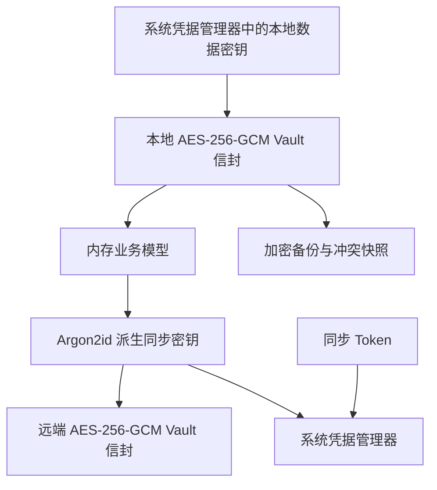

# 配置安全与同步设计

> 状态：已实施设计。
>
> 本项目是新项目，不支持明文 Vault、旧含凭据的 `sync.json` 或其他旧格式的读取与迁移。

## 1. 目标与边界

应用保存 SSH 密码、私钥、AI API Key 和云同步访问凭据。本地业务数据必须加密落盘；同步 Token 与云端解密能力不得写入应用目录、前端状态、日志或诊断包。

当前设计保护被复制的应用数据目录、离线磁盘读取、备份泄露和其他用户的直接文件访问。Windows Credential Manager 和 macOS Keychain 不能阻止与应用相同登录用户身份运行的恶意程序；用户仍应使用 OS 登录保护和全盘加密。



## 2. 本地 Vault

### 2.1 文件与格式

| 位置 | 内容 | 保护 |
| --- | --- | --- |
| `data/vault.json` | 完整业务 Vault | AES-256-GCM 本地信封 |
| `data/vault.json.bak` | 上一个完整 Vault | AES-256-GCM 本地信封 |
| `data/.vault.json.tmp-*` | 写入中的 Vault | AES-256-GCM 本地信封 |
| `data/sync-conflicts/*-local-vault.encrypted.json` | 冲突前本地快照 | AES-256-GCM 本地信封 |
| `data/known_hosts.json` | 受信任 SSH 端点、指纹和确认时间 | 独立 AES-256-GCM 本地信封 |

本地信封格式为：

```json
{
  "formatVersion": 1,
  "cipher": "aes-256-gcm",
  "nonce": "base64...",
  "ciphertext": "base64..."
}
```

业务 JSON 完全置于 `ciphertext` 中。每次写入使用新的随机 12 字节 nonce，并使用固定的、数据类型专属的本地格式标识作为 AES-GCM 认证数据。认证失败、格式错误或不支持的版本均拒绝加载。

`known_hosts.json` 使用相同的本地数据密钥，但使用独立 AAD。其内部仍以规范化 `host:port` 为 SSH 信任索引，保存算法、SHA-256 指纹和确认时间；它不使用 Profile ID 作为主键，也不进入 Vault 或云同步。这样多个 Profile 指向同一 SSH 端点时共享同一主机身份信任记录。

### 2.2 本地数据密钥

首次创建 Vault 时，应用生成随机 32 字节 AES 密钥。它不会保存为 `local.key` 或写入任意应用文件，而是保存到系统凭据管理器：

| 平台 | 存储 |
| --- | --- |
| Windows | Windows Credential Manager |
| macOS | Keychain |

凭据服务名固定为 `com.mjjssh.app`，本地数据密钥账户名为 `local-vault-key-v1`。构建必须启用 `keyring` 的 `windows-native` 与 `apple-native` feature，分别使用 Windows Credential Manager 和 Keychain 后端。

打开已有加密 Vault 时，缺少该密钥必须报错。不得生成新密钥并覆盖现有数据，否则会使原数据不可恢复。主文件读取失败时，仅尝试使用同一密钥读取加密备份；备份验证成功后以加密方式恢复主文件。

### 2.3 写入与恢复

业务修改流程：

1. 在内存副本中完成修改、更新 revision 和时间戳。
2. 校验 UUID、SSH 密钥引用与脚本约束。
3. 序列化业务 JSON，并加密为本地信封。
4. 向同目录加密临时文件写入并执行 `sync_all()`。
5. 将旧主文件复制为加密备份，再原子重命名临时文件。

备份和临时文件属于与主 Vault 同等敏感的数据，必须始终使用本地信封。当前冲突备份没有数量或期限上限，后续需要增加有界保留与删除入口。

## 3. 同步状态与系统凭据

`data/sync.json` 仅保存非秘密同步元数据：

- provider
- remote ID
- 最近同步的远端内容哈希
- 最近同步的 Vault revision 和时间
- 本机 device ID
- `autoSync`

`sync.json` 不得包含 Token、派生同步密钥、同步密码或本地 Vault 数据密钥。

下列条目保存在系统凭据管理器。应用同一时间只允许一个云同步绑定，因此账户名固定，不按 Vault ID 拆分：

| 账户名 | 内容 |
| --- | --- |
| `sync-v1:token` | GitHub Gist 或 Gitee Token |
| `sync-v1:derived-key` | Base64 编码的 32 字节派生同步密钥 |

已配置同步时，系统凭据库固定有三项本应用凭据：一项 `local-vault-key-v1` 和上述两项同步凭据。重复连接、导入、上传、下载或改同步密码均覆盖固定账户，不会新增凭据。关闭同步或删除远端同步库会删除两项同步凭据；没有配置同步时仅保留本地数据密钥。

同步状态接口不返回 Token，前端也不缓存已保存 Token。首次连接时前端仅将用户输入的 Token 和同步密码传给后端；成功后，所有上传、下载、冲突处理、删除远端和改密码操作均由后端从系统凭据管理器读取 Token。

缺失、损坏或不可访问的同步凭据会报“同步凭据不可用”，用户应重新连接云同步并输入 Token 与同步密码。

关闭同步或删除远端同步库时，应用删除固定的 Token 和派生同步密钥条目，并删除 `sync.json`。删除远端仅在远端删除成功后清除本地绑定。

## 4. 同步密码与远端加密

同步密码独立于本地数据密钥：

- 只用于首次连接、导入、更新本机派生密钥和轮换同步密码。
- 不上传、不写入系统凭据库、不写入 `sync.json`，也不返回前端状态。
- 输入密码后使用远端 salt 通过 Argon2id 派生 32 字节密钥。
- 日常同步复用保存的派生密钥，避免反复执行 Argon2id。
- 修改同步密码时轮换 salt、重新加密远端 Vault，并更新凭据管理器中的派生密钥。

远端 `mjjssh-vault.json` 采用现有加密封装：Argon2id（64 MiB、3 次迭代、并行度 4）与 AES-256-GCM。远端封装仍暴露 Vault ID、revision、更新时间、设备 ID、KDF 参数、salt、nonce 与密文长度，但这些字段被 AES-GCM AAD 认证。

## 5. 同步流程

### 5.1 首次连接或导入

1. 用户输入提供方 Token 与同步密码。
2. 后端搜索唯一的远端同步对象。
3. 无远端对象时，加密本地 Vault 并创建私有远端对象。
4. 存在唯一远端对象时，用同步密码解密、校验后覆盖本地 Vault。
5. 后端将 Token 和派生同步密钥保存到系统凭据管理器。
6. 后端将非秘密基线保存到 `sync.json`。

### 5.2 日常同步

上传、下载和状态检查只接受同步命令本身，不接受 Token 参数。后端读取状态和系统凭据后访问提供方 API。

同步基线由本地 revision 和远端封装内容哈希组成：

| 本地相对基线变化 | 远端相对基线变化 | 状态 |
| --- | --- | --- |
| 否 | 否 | `in_sync` |
| 是 | 否 | `local_ahead` |
| 否 | 是 | `remote_ahead` |
| 是 | 是 | `conflict` |

revision 不用于跨设备的时间排序。上传仍存在“读取远端后再更新”的提供方 TOCTOU 窗口；GitHub Gist 与 Gitee snippet 当前没有接入条件写入，不能将检查结果视为 compare-and-swap 保证。

### 5.3 冲突处理

“保留本地”与“采用远端”都会先创建：

- 本地加密 Vault 信封备份。
- 原始远端加密 envelope 备份。

本地快照不允许以明文 JSON 落盘。远端 envelope 本身为密文，但仍应避免在日志、诊断包或前端持久化存储中传播。

## 6. 维护约束

- 不得向日志、错误详情、诊断包、浏览器持久化存储或前端状态写入 Vault 内容、Token、派生密钥、同步密码或本地数据密钥。
- 任何新备份、临时文件、导出、队列或缓存落盘前都必须评估其是否包含业务秘密或解密能力；是则使用本地加密信封或系统凭据管理器。
- 不得创建明文 `local.key`，也不得在缺少既有密钥时重新生成密钥覆盖 Vault。
- 不得把 Token 放入请求 URL；尤其应避免 Gitee Token 出现在代理、网关或服务端 URL 日志中。
- 修改本地信封、系统凭据账户名、同步协议或数据位置时，同步更新 `docs/db.md`、`docs/dev.md` 与本文，并添加对应测试。

## 7. 验收测试

- 本地信封可往返解密，篡改 nonce、密文或 header 会被拒绝。
- `vault.json`、`.bak`、临时文件、本地冲突备份与 `known_hosts.json` 不包含已知秘密或主机端点明文。
- 加密主文件损坏时可从加密备份恢复。
- 明文 Vault 和明文 `known_hosts.json` 被拒绝，不提供迁移兼容路径。
- `sync.json` 不包含 Token 或 `derivedSyncKey`。
- 前端状态与同步状态接口不包含 Token；日常同步 Tauri 命令不接收 Token。
- Token 与派生同步密钥仅由系统凭据管理器读写，并在关闭或删除同步时清除。
- Windows Credential Manager 与 macOS Keychain 的真实后端测试使用随机临时账户写入、读取、删除 32 字节密钥，并用读回密钥完成 AES-256-GCM 加解密。
