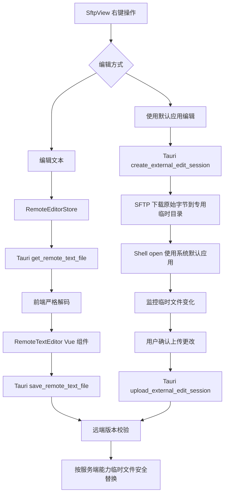
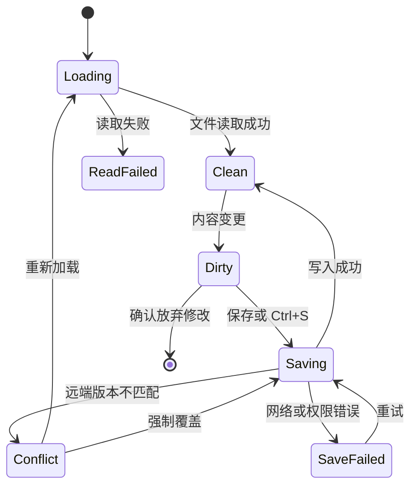

# 远程文本编辑器设计

> 本文定义 MJJSSH 文件管理中的远程文件编辑功能：内置编辑器以 **CodeMirror 6** 为核心；系统默认应用编辑通过本地临时文件完成。两种方式均复用现有 SSH 会话的 SFTP 子系统读取和安全写回远端文件。

## 1. 目标与范围

用户在维护主机时，可从文件管理的文件右键菜单打开常见配置文件并完成编辑、保存和冲突处理，无需进入 `vim`、`nano` 等终端编辑器。它也应支持开发者在远端直接救急修改代码文件，例如 Shell、Python、JavaScript/TypeScript 和 Go 源文件。

该功能是远程文本编辑器，不试图替代用户本机的 VS Code、WebStorm 等专业 IDE：重点是可靠地查看、搜索、修改并安全保存单个远端文件，而不是项目级开发环境。

交付目标：

- 在文件右键菜单中为普通文件提供“编辑文本”和“使用默认应用编辑”。
- “编辑文本”在应用内容区打开可并存的远程编辑标签页，而不是使用阻塞式弹窗。
- “使用默认应用编辑”将远端文件下载到专用临时目录，并交由操作系统为该扩展名关联的默认应用打开。
- 支持读取、编辑、保存、快捷保存、未保存关闭确认和远端变更冲突处理。
- 支持 UTF-8，提供 UTF-8、GBK、GB18030 编码选择。
- 对常见配置和代码格式提供语法高亮：Shell、Nginx、JSON、YAML、TOML、INI、Properties、systemd Unit、Dockerfile、SQL、Terraform、Python、Go、JavaScript/TypeScript、Java/Kotlin、PHP/Ruby/Perl/Lua、Markdown。
- 复用当前 SSH 会话中的 SFTP 客户端，不创建额外 SSH 连接。

功能边界：

- 支持远程配置文件、代码文件及需要救急修复的异常内容；目录和 SFTP 不支持的特殊文件不可编辑。
- 编辑目标始终是当前 SSH/SFTP 会话中的远端文件。
- 版本检查用于防止同一文件被终端、自动化脚本或另一个 MJJSSH 会话意外覆盖；发生冲突时支持重新加载远端版本，或经明确确认后强制覆盖。

## 2. 方案选择

采用 **CodeMirror 6**，不采用 Monaco Editor 或 Ace Editor。

| 维度 | CodeMirror 6 的结论 |
| --- | --- |
| 功能匹配 | 满足配置文件编辑、搜索替换、行号、折行、快捷键和语法高亮。 |
| 体积 | 模块化语言扩展可按需加载，避免为文件管理引入完整 IDE。 |
| 性能 | 适合多个小到中等文本文件同时打开，虚拟化渲染降低长文本的 DOM 压力。 |
| Vue 集成 | 可封装为单一 `RemoteTextEditor.vue`，由父组件管理文件、会话和标签状态。 |
| 主题 | 可从现有 `--app-*` CSS 变量生成亮/暗主题扩展，与应用主题一致。 |
| 扩展性 | 能以独立扩展支持更多文件格式，不影响编辑器核心。 |

Monaco Editor 适合需要完整 VS Code 编辑体验、LSP 和项目级代码导航的远程 IDE；当前以修改运维配置为主要场景，引入它的 Worker 配置、包体积和内存成本不成比例。Ace Editor 的架构和生态相对旧，不适合作为新增编辑能力的基础。

## 3. 用户交互

### 3.1 右键菜单

文件管理器仅对普通文件显示“编辑文本”和“使用默认应用编辑”：

```text
下载
复制文件路径
编辑文本
使用默认应用编辑
编辑权限
压缩为 tar.gz
重命名
删除文件
```

目录和 SFTP 不支持的特殊文件不显示该操作。两个入口都先读取文件类型、大小、修改时间和符号链接信息，不读取完整内容；无读取权限时展示 SFTP 返回的原始权限或读取错误，不能绕过服务端权限限制。

“编辑文本”在实际读取时增加以下风险确认：

1. 文件超过 `2 MiB` 时，使用 `NPopconfirm` 提示“文件超过 2 MiB，打开可能导致程序卡顿或退出”；用户确认后才读取完整内容。
2. 读取完成后，若发现 NUL 字节，使用 `NPopconfirm` 提示“检测到二进制文件，内容可能无法正常解析或保存”；用户确认后才进入编辑器。

`2 MiB` 是内置文本编辑器的风险提示阈值，不是功能上限。其读取实现仍保留 `32 MiB` 原始字节的硬上限，以避免单次请求耗尽桌面应用内存；超过该上限时明确提示文件过大，建议通过终端工具处理。该硬上限需要作为常量集中定义并在界面中展示实际数值。默认应用编辑不受该文本上限限制，应以流式方式下载到磁盘；下载前按文件大小检查本机可用空间并预留安全余量。文件较大时提示占用空间和耗时风险，由用户确认是否继续；仅在可用空间确实不足时拒绝下载。

### 3.2 编辑标签

打开文件后，新建或激活一个远程编辑标签。标签的唯一标识为：

```text
<sessionId>:<normalizedRemotePath>
```

同一会话、同一路径只能打开一个标签；再次点击时激活既有标签。不同主机或不同 SSH 会话中相同路径必须视为不同文件。

编辑器顶部展示：

- 文件名和完整远端路径。
- 编码选择器。
- 当前语言模式或自动识别结果。
- 远端版本状态：`已保存`、`有未保存修改`、`保存中`、`远端已变化` 或 `保存失败`。
- 工具按钮：保存、重新加载、查找/替换、切换自动换行。

保存快捷键为 `Ctrl+S`（macOS 为 `Cmd+S`）。编辑器失焦或切换标签时不自动保存。关闭存在未保存改动的标签时，使用 `NPopconfirm` 或 `NModal` 确认放弃、取消或保存；不得使用浏览器原生确认框。

### 3.3 编码与换行

- 读取命令返回原始字节；前端默认按 UTF-8 严格解码。解码失败时提示选择 GBK 或 GB18030 后重试，且不得静默替换无效字节。
- 前端在成功解码后只将 UTF-8 字符串交给编辑器。Rust 使用 `encoding_rs` 或等效库按所选编码将字符串转换为远端字节；若文本含有该编码无法表示的字符，保存必须失败并明确说明，不能替换为乱码字符。
- 保存时默认沿用打开时的编码；用户主动切换编码后保存使用新选择的编码。
- 保留原文件主要换行风格（LF 或 CRLF）；编辑器内部统一使用 LF，Rust 在编码并写回前转换为原换行风格。
- 不进行自动字符集猜测并静默保存，防止误把中文配置写成乱码。

### 3.4 使用默认应用编辑

“使用默认应用编辑”用于用户希望用本机已安装软件处理文件的场景，例如 VS Code、数据库客户端、图片/二进制查看器或特定配置工具。它不依赖 CodeMirror 的文本解析、编码和 `32 MiB` 文本上限，但须在本机有足够可用磁盘空间时以流式方式下载。

执行流程：

1. 用户从普通文件右键菜单选择“使用默认应用编辑”。
2. 后端通过 SFTP 下载原始字节到专用临时目录：`<app-data>/remote-edit/<sessionId>/<random-id>/<file-name>`。目录名使用随机 ID，不能直接使用远端完整路径，防止路径穿越和不同主机同名文件互相覆盖。
3. 后端记录编辑会话：`sessionId`、远端路径、临时路径、下载时的 `RemoteFileVersion`、本地初始 SHA-256、创建时间和最后检测时间。该记录只在运行时内存保存，不写入 Vault、日志或云同步数据。
4. 前端使用已授权本地文件打开权限的 Tauri Shell 插件 `open(localTempPath)`，请求操作系统按默认关联程序打开该临时文件。没有默认关联程序或系统启动失败时，保留临时文件并展示明确错误和“打开所在目录”操作。
5. 后端监控临时文件的父目录而非只监控文件句柄或单一路径，并以短暂防抖合并连续自动保存。部分应用会以“写入新文件后替换旧文件”的方式保存，目录级监控才能可靠重新计算目标临时路径的 SHA-256。检测到本地 SHA-256 与初始值不同后，界面显示“本地文件已修改，等待上传”，提供“上传更改”“重新下载远端版本”和“放弃本地更改”。
6. “重新下载远端版本”会丢弃本地临时修改，必须二次确认后才用新的原始字节替换临时文件，并更新下载时版本和本地初始 SHA-256。
7. 用户点击“上传更改”后，后端再次读取临时文件并将其作为原始字节上传；上传前使用下载时的 `RemoteFileVersion` 执行与内置编辑器相同的尽力冲突检测。未发现冲突时以临时文件安全替换流程覆盖远端文件。
8. 上传成功后，用新的远端版本与当前本地 SHA-256 更新编辑会话；本地程序后续再次保存时仍会再次出现待上传状态。

系统默认应用无法提供可靠的“保存完成”回调。文件监控只能说明临时文件发生变化，不能安全地推断用户已完成编辑；因此检测到变化后必须由用户显式点击“上传更改”，不得自动覆盖远端文件。

临时文件规则：

- 每个编辑会话使用独立临时目录，且保留远端原始文件名和扩展名，以确保系统关联程序正确识别类型。
- 临时目录权限仅允许当前用户访问；临时文件内容不进入诊断包、应用日志或云同步 Vault。
- 用户选择“放弃本地更改”后删除临时目录；上传成功后默认保留临时目录直到编辑会话结束，避免外部程序尚未释放文件时删除失败。
- 退出应用时清理未被外部程序锁定的临时目录；清理失败时在下次启动前清理过期目录。不得静默上传遗留临时文件。
- 外部程序仍在写入或锁定文件时，上传应失败并保留临时文件，提示用户关闭或保存外部程序后重试。

## 4. 架构



### 4.1 前端模块

新增或调整以下模块：

| 路径 | 职责 |
| --- | --- |
| `src/components/RemoteTextEditor.vue` | CodeMirror 生命周期、工具栏、编码/语言选择、编辑状态与保存交互。 |
| `src/components/SftpView.vue` | 文件右键菜单入口，发出内置或默认应用编辑请求。 |
| `src/components/ExternalEditPanel.vue` | 位于对应 SFTP 会话文件管理界面的持久状态区，展示默认应用编辑会话、临时文件变更状态及上传/重新下载/放弃操作。 |
| `src/stores/remoteEditor.ts` | 内置编辑标签集合、文件初始版本、草稿和关闭确认状态。 |
| `src/stores/externalEditor.ts` | 默认应用编辑会话、临时文件状态和上传状态。 |
| `src/types/index.ts` | 远端文本文件、默认应用编辑会话、版本信息、保存结果和冲突类型。 |
| `src/App.vue` | 按需加载内置编辑器和默认应用编辑面板。 |

编辑器组件必须使用 `defineAsyncComponent` 按需加载。CodeMirror 及语言扩展只在首次打开远程文本时加载，不进入应用启动关键路径。

建议的核心类型：

```ts
interface RemoteFileMetadata {
  sessionId: string
  path: string
  size: number
  modifiedAt: string | null
  isSymlink: boolean
  isSupportedFile: boolean
}

interface RemoteTextFile {
  sessionId: string
  path: string
  content: string
  encoding: 'utf-8' | 'gbk' | 'gb18030'
  lineEnding: 'lf' | 'crlf'
  containsNul: boolean
  language: RemoteEditorLanguage
  version: RemoteFileVersion
}

interface RemoteTextFileBytes {
  bytes: number[]
  containsNul: boolean
  version: RemoteFileVersion
}

interface RemoteFileVersion {
  size: number
  modifiedAt: string | null
  contentHash: string
}

interface OpenRemoteTextFileRequest {
  sessionId: string
  path: string
  allowLargeFile: boolean
}

interface ExternalEditSession {
  editId: string
  sessionId: string
  path: string
  tempFileName: string
  status: 'clean' | 'pending-upload' | 'uploading' | 'conflict' | 'error'
  version: RemoteFileVersion
}

type ExternalEditSessionStatus = ExternalEditSession

interface SaveRemoteTextFileRequest {
  sessionId: string
  path: string
  content: string
  encoding: 'utf-8' | 'gbk' | 'gb18030'
  lineEnding: 'lf' | 'crlf'
  expectedVersion: RemoteFileVersion
  force: boolean
  confirmBinaryWrite: boolean
}

type SaveRemoteTextFileResult =
  | { kind: 'saved'; version: RemoteFileVersion }
  | { kind: 'conflict'; currentVersion: RemoteFileVersion }

type UploadExternalEditResult =
  | { kind: 'uploaded'; version: RemoteFileVersion }
  | { kind: 'conflict'; currentVersion: RemoteFileVersion }
```

`contentHash` 为原始字节的 SHA-256，不以解码后的字符串计算。它用于识别仅编码或换行不同的远端变更。

### 4.2 CodeMirror 6 配置

`RemoteTextEditor.vue` 应将 CodeMirror 封装在组件内部，不把 `EditorView` 放入 Pinia 或全局状态。组件销毁时调用 `view.destroy()`，避免标签关闭后遗留事件监听或 DOM 节点。

基础扩展：

```text
basicSetup
history
lineNumbers
highlightActiveLine
highlightActiveLineGutter
drawSelection
keymap.of([historyKeymap, searchKeymap, defaultKeymap, saveKeymap])
search
highlightSelectionMatches
EditorView.lineWrapping（由用户选项控制）
```

语言识别优先根据文件名和扩展名：

| 文件名或扩展名 | 语言模式 |
| --- | --- |
| `nginx.conf`、`*.nginx` | Nginx |
| `*.conf` | 通用配置 |
| `*.sh`、`.bashrc`、`.profile`、`.zshrc` | Shell |
| `.env`、`.env.*` | 环境变量配置 |
| `*.json` | JSON |
| `*.yaml`、`*.yml`、`docker-compose.yml`、`compose.yml` | YAML / Docker Compose |
| `*.toml` | TOML |
| `*.ini`、`*.cfg`、`*.properties` | INI / Properties |
| `*.service`、`*.socket`、`*.timer`、`*.mount` | systemd Unit |
| `*.xml` | XML |
| `Dockerfile`、`Containerfile` | Dockerfile |
| `*.sql` | SQL |
| `*.tf`、`*.tfvars` | Terraform / HCL |
| `*.py` | Python |
| `*.go` | Go |
| `*.js`、`*.ts` | JavaScript / TypeScript |
| `*.java`、`*.kt` | Java / Kotlin |
| `*.php`、`*.rb`、`*.pl`、`*.lua` | PHP / Ruby / Perl / Lua |
| `*.md` | Markdown |
| 其他 | 纯文本 |

语言扩展同样按需 `import()`。无法识别的格式必须仍可作为纯文本编辑，不得拒绝打开。

亮暗主题通过现有 CSS 变量生成 CodeMirror 的 `EditorView.theme` 与 `HighlightStyle`。组件不能硬编码普通背景、文字和边框颜色；须与 `--app-base`、`--app-surface`、`--app-border`、`--app-text`、`--app-muted`、`--app-accent` 保持一致。

### 4.3 Rust 与 SFTP 命令

在 `src-tauri/src/commands/sftp.rs` 新增专用命令，不复用面向下载的文件传输命令：

```text
get_remote_file_metadata(session_id, path) -> RemoteFileMetadata
get_remote_text_file(request) -> RemoteTextFileBytes
save_remote_text_file(request) -> SaveRemoteTextFileResult
create_external_edit_session(session_id, path) -> ExternalEditSession
get_external_edit_session_status(edit_id) -> ExternalEditSessionStatus
upload_external_edit_session(edit_id, force) -> UploadExternalEditResult
discard_external_edit_session(edit_id) -> ()
```

读取命令：

1. 从 `SessionManager` 取得现有 `Arc<SshSession>` 后立即释放 session map 锁。
2. 复用该会话缓存的 `SftpSession`。
3. `get_remote_file_metadata` 使用 `stat`/`lstat` 获取类型、大小、修改时间和符号链接信息，拒绝目录、不支持的特殊类型和符号链接。符号链接返回“链接文件，暂不支持编辑”，不进入读取流程。
4. 文件大于 `2 MiB` 时，前端经确认后以 `allowLargeFile: true` 调用 `get_remote_text_file`；未确认的大文件直接返回风险状态，不读取内容。
5. 以有界读取获得最多 `32 MiB + 1` 原始字节；超过硬上限时中止并返回明确错误。
6. 检查 NUL 字节并返回 `containsNul` 风险标记；前端确认后才创建编辑器。
7. 为原始字节计算 SHA-256，并连同文件大小、修改时间和风险标记返回前端。

保存命令：

1. 若文件包含 NUL 字节，要求 `confirmBinaryWrite: true`；否则拒绝保存并提示“保存会重新编码整个文件，可能破坏二进制内容”。
2. Rust 按请求编码及换行风格生成字节；无法无损编码或编码后超过 `32 MiB` 硬上限时，保存失败。
3. 读取目标文件当前字节并计算 SHA-256，获取当前 `size` 与 `modifiedAt`。当 `force` 为 `false` 时，与 `expectedVersion` 不一致即返回 `conflict`，不写入。
4. 将此检查定义为尽力冲突检测：目标文件仍可能在检查后、最终替换前被其他进程修改；界面不得承诺完全避免覆盖。
5. 对普通文件读取原 POSIX mode；服务端不支持时继续保存但记录能力缺失。符号链接已在元数据预检时拒绝，保存命令仍须再次校验，避免路径在读取后被替换为链接。
6. 在同一目录创建随机临时路径，例如：

   ```text
   .mjjssh-<UUID>.tmp
   ```

7. 将完整新内容流式写入临时文件并关闭句柄，并尽力设置原 POSIX mode。
8. 根据 SFTP 服务端已探测的 rename-overwrite 能力替换目标文件；仅在服务端明确提供相应语义时才视为原子替换。若不支持安全覆盖，保存失败并保留原文件，同时报告临时文件是否已清理。
9. 重新 `stat` 和计算写后 SHA-256，返回新的 `RemoteFileVersion`。此步骤仅确认写后状态，不能消除并发写入竞争。
10. 失败时尽力删除临时文件；清理失败记录日志，但主错误必须保留原始写入原因。

不得使用 shell 命令、`cat > path`、`sed` 或远端终端输出来读写文件。路径必须交给 SFTP API 处理，不能基于字符串拼接 shell 命令。

## 5. 并发与冲突处理

远端文本编辑不能依赖修改时间单独判断，因为部分 SFTP 服务端的时间精度不足且管理员工具可能保留时间戳。`contentHash` 是主要比较条件，`size` 和 `modifiedAt` 用于诊断和界面展示。该比较是尽力冲突检测：标准 SFTP 不提供基于 hash 的条件替换，检查完成到最终替换之间仍存在无法完全消除的竞争窗口。

保存状态机：



冲突提示必须明确说明：远端文件自打开后被修改，当前草稿尚未写入。提供以下操作：

- **重新加载**：放弃本地未保存草稿，读取远端最新版本；必须二次确认。
- **取消**：留在编辑器中，保留本地草稿。
- **强制覆盖**：以 `force: true` 再次保存；必须使用 `NPopconfirm` 并说明会覆盖远端最新内容。

不自动合并冲突内容，避免配置文件被错误合并后仍显示为可保存。

## 6. 安全与可靠性

- 内置编辑器和默认应用编辑的读取、保存和上传均只使用已建立且仍有效的 SSH 会话；会话断开后保留本地草稿或临时文件，但上传显示可重试错误，待用户恢复该会话后手动重试。不得缓存凭据或新建后台连接。
- 路径来自当前 SFTP 目录项或前端已打开标签，后端仍必须拒绝空路径和不支持的文件类型。
- 文件内容、内置编辑草稿、默认应用临时文件路径、远端路径和哈希不得写入普通应用日志、诊断包或云同步 Vault。
- 内置编辑器不持久化未保存草稿。默认应用编辑的临时文件仅存于专用临时目录，并按临时文件规则清理；应用崩溃或强制退出后不得自动上传遗留文件。
- 写回时创建的远端临时文件必须与目标文件位于同一远端目录，以便在服务端支持覆盖 rename 时进行安全替换；默认应用编辑始终先下载到本地专用临时目录，再通过该远端临时文件流程上传。
- 保存前和写入后均需校验 SFTP 返回错误，特别是权限不足、磁盘满、目录只读、连接中断和重命名失败。
- 仅尽力保留 POSIX mode；不承诺保留 owner、group、ACL、SELinux context 或其他扩展属性。保存前必须展示该风险。
- 检测到远端符号链接时，仅显示“链接文件，暂不支持编辑”，不读取或保存，避免临时文件重命名替换符号链接本身。

## 7. 测试与验证

### 7.1 Rust 单元测试

为文本文件命令和底层 SFTP 辅助函数覆盖：

- 内置编辑器：目录、不支持的特殊文件和符号链接被拒绝；超过 `32 MiB` 硬上限的文件返回明确错误。
- 大于 `2 MiB` 的文件只有在 `allowLargeFile: true` 时读取；含 NUL 字节的文件返回风险标记，确认后可进入编辑器。
- UTF-8、GBK 和 GB18030 的严格解码及无损编码；编码无法表示字符时保存失败。
- 含 NUL 字节的文件未设置 `confirmBinaryWrite: true` 时拒绝保存。
- 正确版本保存成功并返回新的 hash；相同路径的远端内容在保存前已经变更时，普通保存返回冲突且不写入。
- `force: true` 可跳过保存前版本比较，但界面仍须警告覆盖风险。
- 临时文件命名不与目标文件冲突，写入失败后执行清理；分别覆盖支持和不支持覆盖 rename 的服务端行为。
- 在模拟服务端支持时尽力保留原 POSIX mode，不承诺其他权限属性。
- 默认应用编辑：临时文件保留原始字节和扩展名；本地变化只能使状态变为待上传，绝不自动覆盖远端；目录级监控能识别外部应用的原子替换式保存；上传时复用版本冲突检测；放弃、退出和下次启动时按规则清理临时目录。

### 7.2 前端组件测试

- 根据扩展名选择语言模式，未知文件使用纯文本。
- 默认应用编辑在无关联程序、缺少本地文件打开权限、外部程序锁定临时文件、原子替换式保存、本地文件变化、重新下载、放弃、断线重试和上传冲突时展示正确状态。
- 编辑后状态变为未保存，保存成功后恢复已保存。
- `Ctrl+S` 调用保存并阻止浏览器默认行为。
- 关闭未保存标签展示确认；取消后草稿不丢失。
- 冲突状态正确显示重新加载、取消和强制覆盖操作。
- 亮色与暗色主题下编辑器的文本、边框、选区、光标与搜索结果可读。

### 7.3 集成验证

在可控 SSH/SFTP 环境验证：

1. 打开、编辑并保存 `/etc` 下具有可写权限的测试配置文件。
2. 分别确认大于 `2 MiB` 文件和含 NUL 字节文件的风险提示及继续打开流程；确认含 NUL 文件保存前会再次提示。
3. 在两个会话中同时编辑同一文件，确认第二次普通保存被拦截，并在文档/界面中验证该机制仅为尽力检测。
4. 分别验证 UTF-8、GBK 与 GB18030 的读取、无损写回和无法编码字符的失败提示。
5. 验证符号链接不提供编辑入口，以及支持和不支持覆盖 rename 的 SFTP 服务端保存行为。
6. 断开 SSH 后保存，确认报错且编辑草稿保留。
7. 保存后重新打开，确认内容、换行和 POSIX mode 符合预期。
8. 默认应用编辑：确认系统默认应用收到保留原扩展名的临时文件；本地修改后仅提示待上传，用户确认后才覆盖远端；验证外部应用以替换文件方式保存时仍能检测变化；验证断线后保留临时文件并在会话恢复后手动上传；验证锁定和应用重启后的临时目录清理符合规则。
9. 分别检查亮色和暗色主题，以及小窗口布局。

改动完成前至少执行：

```sh
npm run build --prefix my-ssh-frontend
cargo check --manifest-path my-ssh-frontend/src-tauri/Cargo.toml
cargo test --manifest-path my-ssh-frontend/src-tauri/Cargo.toml
cargo fmt --manifest-path my-ssh-frontend/src-tauri/Cargo.toml -- --check
git diff --check
```

## 8. 实施清单

- 定义远端文本文件、版本信息和保存结果的前后端类型。
- 实现元数据预检、带风险提示的 SFTP 文件读取、二进制检测、Rust 端编解码、内容 hash 和基于服务端能力的临时文件安全替换。
- 在 `SftpView` 文件右键菜单接入“编辑文本”和“使用默认应用编辑”。
- 新增 `remoteEditor` store、编辑标签和 `RemoteTextEditor.vue`。
- 新增默认应用编辑会话、专用临时目录、流式下载与可用磁盘预检、大文件风险提示、目录级文件监控、显式上传确认和过期临时目录清理。
- 集成 CodeMirror 6 的编辑、搜索替换、行号、自动换行、主题和所列语言高亮。
- 完成编码切换、换行保留、快捷保存、未保存关闭确认、保存错误和冲突操作。
- 覆盖 Rust 单元测试、前端组件测试及真实 SFTP 环境的亮暗主题、窄窗口、断线与冲突验证。
